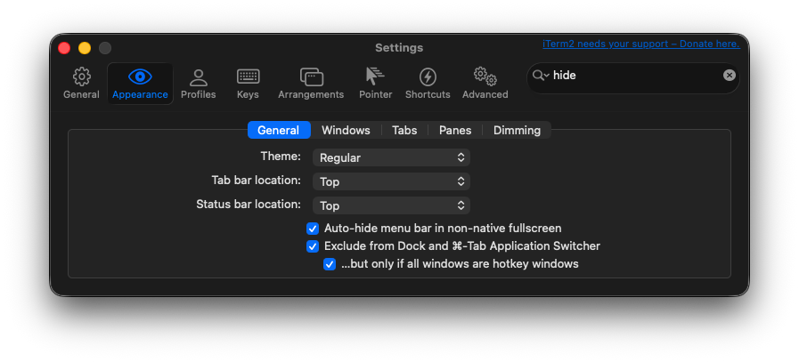

# oh-my-mac

My Mac setup, managed declaratively.

## Prerequisites

### Homebrew

```bash
/bin/bash -c "$(curl -fsSL https://raw.githubusercontent.com/Homebrew/install/HEAD/install.sh)"
```

Add to `~/.zshrc`:

```bash
eval "$(/opt/homebrew/bin/brew shellenv)"
```

## Quick Start

```bash
git clone git@github.com:tani-shi/oh-my-mac.git ~/dev/oh-my-mac
cd ~/dev/oh-my-mac
make install
```

## What's Included

### Homebrew Packages (`Brewfile`)

| Category | Packages |
| --- | --- |
| Shell | starship, sheldon, fzf, ripgrep, shellcheck, shfmt |
| Modern CLI replacements | bat, eza, fd, delta, zoxide |
| Terminal multiplexer | tmux |
| Utilities | jq, sqlite, tree, btop, duti |
| Font | font-jetbrains-mono-nerd-font |
| Development | fnm, mise, pnpm, uv, terraform, awscli, gcloud-cli, visual-studio-code |
| Git / GitHub | gh, git-lfs |
| Google Workspace | gogcli |

### Trusted Homebrew Taps (`config/homebrew/trusted-taps.txt`)

Homebrew 6.x refuses to load formulae from non-official taps unless they are explicitly trusted. `make install` / `make update` / `make upgrade` run `make trust-taps` before bundling to trust these idempotently, so a fresh machine installs in one shot.

| Tap | Used by |
| --- | --- |
| hashicorp/tap | terraform |
| steipete/tap | gogcli |
| openclaw/tap | gogcli (resolved formula tap) |

### Config Files

| Source | Destination |
| --- | --- |
| `config/starship.toml` | `~/.config/starship.toml` |
| `config/sheldon/plugins.toml` | `~/.config/sheldon/plugins.toml` |
| `config/mise/config.toml` | `~/.config/mise/config.toml` |
| `config/zshrc` | `~/.zshrc` |
| `config/git/ignore` | `~/.config/git/ignore` |
| `config/claude/CLAUDE.md` | `~/.claude/CLAUDE.md` |
| `config/claude/settings.json` | `~/.claude/settings.json` |
| `config/claude/keybindings.json` | `~/.claude/keybindings.json` |
| `config/claude/scripts/*.zsh` | `~/.claude/scripts/` |
| `config/vscode/settings.json` | `~/Library/Application Support/Code/User/settings.json` |

### pnpm Global Packages (`config/pnpm/globals.txt`)

| Package | Description |
| --- | --- |
| typescript | TypeScript compiler (`tsc`) |

### mise Tools (`config/mise/config.toml`)

[mise](https://mise.jdx.dev/) manages the .NET SDK. SDK versions install side-by-side under a single `DOTNET_ROOT`, matching .NET's native multi-version model, and per-project `global.json` selects the build SDK. `mise activate` (in `config/zshrc`) sets `DOTNET_ROOT`. `make install` / `make update` run `mise install` to materialize pinned versions.

| Tool | Version |
| --- | --- |
| dotnet | 10.0.301 (.NET 10 SDK) |

### uv Tools (`config/uv/tools.txt`)

| Tool | Source |
| --- | --- |
| claude-sentinel | [tani-shi/claude-sentinel](https://github.com/tani-shi/claude-sentinel) |

### VSCode Extensions (`config/vscode/extensions.txt`)

| Extension | Description |
| --- | --- |
| kaiwood.center-editor-window | Center the active line in the editor |
| ms-dotnettools.csharp | C# language support (Roslyn) |
| ms-dotnettools.csdevkit | C# Dev Kit — .NET IntelliSense, project/solution navigation |

Add extensions as `publisher.extension-name` per line.

### Claude Code Plugins (`config/claude/plugins.txt`)

| Plugin | Registry |
| --- | --- |
| example-skills | anthropic-agent-skills |
| tani-shi-skills | tani-shi-skills |
| claude-md-management | claude-plugins-official |
| code-review | claude-plugins-official |
| code-simplifier | claude-plugins-official |
| context7 | claude-plugins-official |
| feature-dev | claude-plugins-official |
| frontend-design | claude-plugins-official |
| playground | claude-plugins-official |
| playwright | claude-plugins-official |
| superpowers | claude-plugins-official |

## Usage

| Command | Description |
| --- | --- |
| `make` / `make help` | Show available targets |
| `make install` | Install packages + sync config + install plugins |
| `make update` | Sync config + install missing packages (no upgrades) |
| `make upgrade` | Investigate upgrades via Claude Agent SDK, apply them, and auto-commit |
| `make trust-taps` | Trust non-official Homebrew taps listed in `config/homebrew/trusted-taps.txt` |
| `make snapshot-versions` | Save installed versions to `versions.json` |
| `make diff-config` | Show differences between repo and local config |
| `make sync-config` | Sync config files only |

## Post-install Setup

These require interactive authentication and cannot be automated:

### SSH key + GitHub auth

```bash
ssh-keygen
gh auth login
# Protocol: SSH / Key: id_ed25519
```

### gogcli (Google Workspace)

```bash
gog auth credentials ~/Downloads/client_secret_*.json
gog auth add you@gmail.com
```

### iTerm2

- Primary terminal for shell work and Claude Code; tab title shows the current directory basename, and tab color flips green on Claude Code completion / orange while it's awaiting input / purple while `claude-sentinel` is running a slow LLM-backed permission judgment (managed by zsh hooks + Claude Code Stop/Notification/PermissionRequest hooks)
- Managed via Dynamic Profile (`config/iterm2/profile.json`), synced by `make sync-config`
- After first sync: **Profiles → oh-my-mac → Other Actions… → Set as Default** to apply

  

- For SSH with native pane splits, use tmux Control Mode: `ssh host -t 'tmux -CC new -A -s main'`
- Manual steps required for tmux integration (**Settings → General → tmux**):
  - **Attaching**: "Tabs in the attaching window"
  - **Automatically bury the tmux client session after connecting**: ON
- Manual steps required for app-global appearance (**Settings → Appearance → General**) — these are application-wide preferences, not profile-scoped, so they cannot be set via Dynamic Profile and must be enabled by hand:
  - **Auto-hide menu bar in non-native fullscreen**: ON
  - **Exclude from Dock and ⌘-Tab Application Switcher**: ON
  - **…but only if all windows are hotkey windows**: ON (required to keep the option above enabled)

  

### macOS Performance

- Managed via `defaults write` in `make sync-config`: window animations disabled
- Manual steps required for accessibility settings:
  - **System Settings → Accessibility → Display → Reduce Motion**: ON
  - **System Settings → Accessibility → Display → Reduce Transparency**: ON
