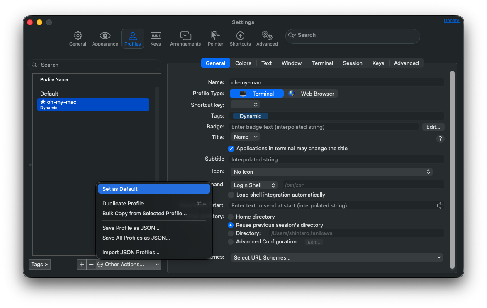

# oh-my-mac

My Mac setup, managed declaratively.

## Prerequisites

### Homebrew

```bash
/bin/bash -c "$(curl -fsSL https://raw.githubusercontent.com/Homebrew/install/HEAD/install.sh)"
```

Add to `~/.zshrc`:

```bash
eval "$(/opt/homebrew/bin/brew shellenv)"
```

## Quick Start

```bash
git clone git@github.com:tani-shi/oh-my-mac.git ~/dev/oh-my-mac
cd ~/dev/oh-my-mac
make install
```

## What's Included

### Homebrew Packages (`Brewfile`)

| Category | Packages |
| --- | --- |
| Shell | starship, sheldon, fzf, ripgrep, shellcheck, shfmt |
| Font | font-jetbrains-mono-nerd-font |
| Development | fnm, pnpm, uv, terraform |
| Git / GitHub | gh |
| Google Workspace | gogcli |

### Config Files

| Source | Destination |
| --- | --- |
| `config/starship.toml` | `~/.config/starship.toml` |
| `config/sheldon/plugins.toml` | `~/.config/sheldon/plugins.toml` |
| `config/zshrc` | `~/.zshrc` |
| `config/git/ignore` | `~/.config/git/ignore` |
| `config/claude/CLAUDE.md` | `~/.claude/CLAUDE.md` |
| `config/claude/settings.json` | `~/.claude/settings.json` |
| `config/claude/keybindings.json` | `~/.claude/keybindings.json` |
| `config/claude/scripts/check-docs.zsh` | `~/.claude/scripts/check-docs.zsh` |

### uv Tools (`config/uv/tools.txt`)

| Tool | Source |
| --- | --- |
| claude-sentinel | [tani-shi/claude-sentinel](https://github.com/tani-shi/claude-sentinel) |

### Claude Code Plugins (`config/claude/plugins.txt`)

| Plugin | Registry |
| --- | --- |
| example-skills | anthropic-agent-skills |
| tani-shi-skills | tani-shi-skills |
| claude-md-management | claude-plugins-official |
| code-review | claude-plugins-official |
| code-simplifier | claude-plugins-official |
| context7 | claude-plugins-official |
| feature-dev | claude-plugins-official |
| frontend-design | claude-plugins-official |
| playground | claude-plugins-official |
| playwright | claude-plugins-official |
| superpowers | claude-plugins-official |

## Usage

| Command | Description |
| --- | --- |
| `make install` | Install packages + sync config + install plugins |
| `make update` | Sync config + install missing packages (no upgrades) |
| `make upgrade` | Launch Claude Code to investigate and apply dependency upgrades |
| `make snapshot-versions` | Save installed versions to `versions.json` |
| `make diff-config` | Show differences between repo and local config |
| `make sync-config` | Sync config files only |

## Post-install Setup

These require interactive authentication and cannot be automated:

### SSH key + GitHub auth

```bash
ssh-keygen
gh auth login
# Protocol: SSH / Key: id_ed25519
```

### gogcli (Google Workspace)

```bash
gog auth credentials ~/Downloads/client_secret_*.json
gog auth add you@gmail.com
```

### iTerm2

- Managed via Dynamic Profile (`config/iterm2/profile.json`), synced by `make sync-config`
- After first sync: **Profiles → oh-my-mac → Other Actions… → Set as Default** to apply

  

### macOS Performance

- Managed via `defaults write` in `make sync-config`: window animations disabled
- Manual steps required for accessibility settings:
  - **System Settings → Accessibility → Display → Reduce Motion**: ON
  - **System Settings → Accessibility → Display → Reduce Transparency**: ON
