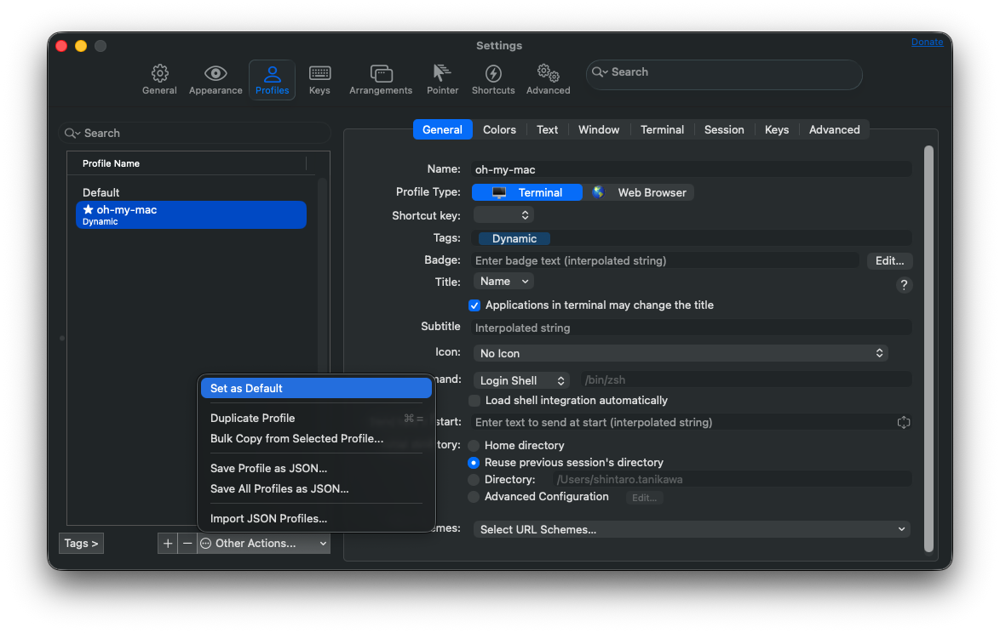
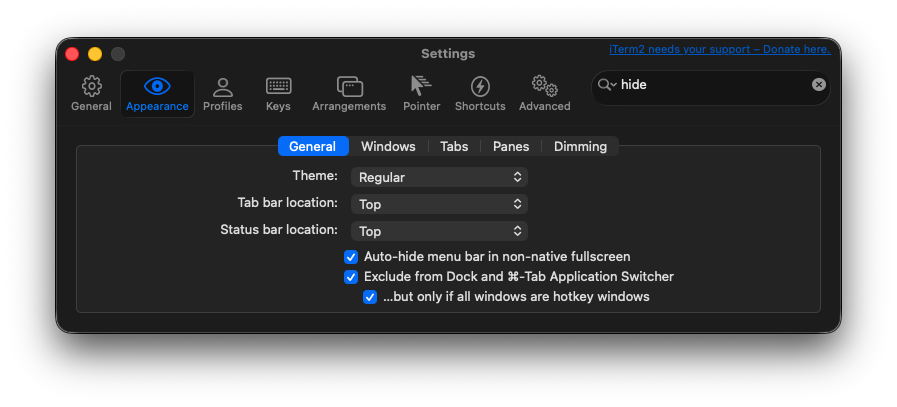

# oh-my-mac

My Mac setup, managed declaratively.

## Prerequisites

This repository supports only Apple Silicon (arm64) Macs. Homebrew and the synced
`~/.zshrc` assume Homebrew's standard Apple Silicon prefix, `/opt/homebrew`.

### Homebrew Setup

Install Homebrew and initialize the current shell for the commands that follow:

```bash
/bin/bash -c "$(curl -fsSL https://raw.githubusercontent.com/Homebrew/install/HEAD/install.sh)"
eval "$(/opt/homebrew/bin/brew shellenv)"
```

## Quick Start

On a new machine, run the following commands to install the required tools and sync the configuration:

```bash
mkdir -p ~/dev
git clone https://github.com/tani-shi/oh-my-mac.git ~/dev/oh-my-mac
cd ~/dev/oh-my-mac
make install
```

Before installing on an existing machine, review the pending changes and your Claude configuration before running `make install`. `make diff-config` requires sync dependencies such as `agent-sentinel` and `jq`, plus the pinned Python environment prepared by `make install-config-tools`; preparing that environment requires `uv`. If the sync dependencies are already installed, run these commands first:

```bash
make install-config-tools
make diff-config
```

If the sync dependencies are not installed and `make diff-config` cannot run, manually back up your Claude configuration before running `make install`. After installing its dependencies, `make install` runs `make sync-config` without confirmation and permanently deletes repository-unmanaged entries from `~/.claude/agents/`, `~/.claude/scripts/`, and `~/.claude/skills/`. For example, copy existing data outside the repository with:

```bash
backup_dir="$HOME/claude-config-backup-$(date +%Y%m%d-%H%M%S)"
mkdir -p "$backup_dir"
for name in agents scripts skills; do
  [[ -e "$HOME/.claude/$name" ]] && cp -R "$HOME/.claude/$name" "$backup_dir/"
done
```

Add any agents, scripts, and skills you want to retain under `config/claude/` at their corresponding relative paths. See [Config Sync Scope](#config-sync-scope) for ownership details and side effects.

## Dependency Version Guarantees

This repository pins selected direct tool versions; it does not provide a complete dependency lock or byte-for-byte environment reproduction. It records no artifact hashes and does not lock Homebrew packages, npm transitive dependencies, installer or bootstrap code, extension marketplaces, or plugin marketplaces. An exact pin therefore constrains the named direct version, not every input used to install it.

The table below is the complete inventory of versioning guarantees and exceptions for dependencies managed by this repository.

| Dependency | Repository declaration | `make install` / `make update` | Explicit `$upgrade` | Reproducibility boundary |
| --- | --- | --- | --- | --- |
| Homebrew formulae, casks, and taps | `Brewfile` and `config/homebrew/trusted-taps.txt` declare membership only. | `make install` runs `brew bundle --no-upgrade`, while `make update` runs `brew bundle` and advances outdated entries to the versions available at run time. | Applies only the individually approved outdated formulae and casks from a validated selective plan. | Package versions, tap revisions, Homebrew itself, and transitive dependencies are not locked by this repository. |
| Claude Code | `config/claude/version` contains an exact version. | Installs that version and verifies the installed version, including after the fallback installer. | The reviewed version replaces the pin and is then installed and verified. | The direct installed version is fixed. The downloaded installer and artifacts are not hashed or vendored here. |
| Node.js global default | `config/fnm/version` contains an exact version. | `fnm` installs and selects that version as the global default. | The routine upgrade workflow does not investigate or change this pin. | The Node.js version is fixed, but the Homebrew-installed `fnm`, downloaded artifacts, and project-local `.node-version` / `.nvmrc` overrides are outside that guarantee. |
| Notion CLI | `config/ntn/version` contains an exact npm package version. | Installs the declared direct package version globally. | The reviewed version replaces the pin and is installed. | The direct npm package version is fixed; npm transitive resolution and artifacts are not locked here. |
| Codex CLI | The repository declares no Codex CLI version. | Installs the current npm release only when the `codex` command is absent. An existing installation is left untouched. | The routine upgrade workflow does not investigate, install, or update Codex CLI. | The installed version, npm transitive resolution, artifacts, and subsequent update lifecycle are outside repository control. |
| Codex config tools | `config/uv/config-tools.txt` pins direct Python packages with `==`; the virtual environment requests Python `>=3.11`. | Rebuilds the environment when Python is unsuitable or a declared direct package version differs. | The routine upgrade workflow does not investigate or change these pins. | Direct package versions are fixed. The Python minor/patch version, transitive dependencies, and artifacts are not locked here. |
| Sheldon plugins | Each remote plugin in `config/sheldon/plugins.toml` uses a `tag` or `rev`; the generated Sheldon lock stays under the user's home directory. | A changed synced config runs `sheldon lock --update`, resolving the declared references. | The workflow may change approved references, but `make upgrade-apply` does not run config sync; the local Sheldon checkout changes on the next `make install` or `make update`. | A commit `rev` identifies a commit, while a tag can be moved upstream. No Sheldon lock is committed, so fresh installations are not locked to recorded commits. |
| uv tools | Entries normally require an `@tag` or `@commit`. The current `agent-sentinel` and `claude-sessions` entries intentionally reference Git HEAD. | Installs missing tools but does not request upgrades for an unchanged installed requirement. A fresh install of either exception resolves the then-current HEAD. | `make upgrade-apply` likewise does not advance unchanged HEAD requirements. `make refresh-agent-sentinel` explicitly upgrades `agent-sentinel`; no repository workflow refreshes an existing `claude-sessions` installation. | The two HEAD sources and their dependency graphs are unpinned. |
| VS Code extensions | `config/vscode/extensions.txt` declares extension IDs only. | Config sync installs missing IDs from the marketplace without a version and leaves installed extensions untouched. | The upgrade workflow does not manage extension versions. | Extension versions are not recorded or controlled after installation. |
| Claude Code plugins | `config/claude/plugins.txt` declares user-scope membership only; marketplaces are external. | Installs missing declarations and removes undeclared user-scope plugins without requesting updates for installed declarations. | Updates only the individually approved declared plugins from a validated selective plan. | Plugin versions and marketplace definitions are not recorded in this repository. |

`make update` upgrades Homebrew entries and converges the remaining dependencies: a newer checkout can move explicitly pinned tools to its declared versions, while Homebrew entries advance to the versions available at run time. It does not request updates for an existing Codex CLI, existing Claude Code plugins, existing VS Code extensions, or unchanged uv tool requirements.

`$upgrade` is the explicit Codex workflow for routine upgrades. Its invocation authorizes Codex to select safe versions, update the version sources it owns, selectively upgrade approved `Brewfile` entries and declared Claude Code plugins, install selected direct pins, test and review the result, and create and merge one pull request without further version, commit, pull request, or merge approval. Every candidate is classified independently as an upgrade, risk hold, incompatibility hold, execution-blocked hold, or unchanged; a hold does not block unrelated safe work. The validated plan applies no held candidate, and an isolated application failure becomes a candidate hold only when read-only checks prove package-manager state stayed unchanged. Uncertain partial state, unavoidable held shared dependencies, unisolatable test failures, and unresolved required gates remain workflow-wide stops. Claude Code remains an upgrade target, but no Claude prompt or agent session participates in the workflow. Node.js, Codex CLI, and the Codex config-tools environment are outside that routine investigation; Sheldon reference changes take effect through the next config sync.

## Agent Instructions

Claude Code and Codex both work in this repository, and both read their instructions from one place per scope.

| File | Scope | Read by |
| --- | --- | --- |
| `AGENTS.md` | this repository | Claude Code, Codex |
| `CLAUDE.md` | this repository | Claude Code |
| `.codex/config.toml` (`developer_instructions`) | this repository | Codex |
| `config/agents/instructions.md` | every repository, as user settings | Claude Code, Codex |
| `config/claude/instructions.md` | every repository, as user settings | Claude Code |
| `config/codex/instructions.md` | every repository, as user settings | Codex |

`AGENTS.md` holds the project instructions both agents follow. Codex finds it by its own discovery rules; `CLAUDE.md` pulls it in with `@AGENTS.md` and adds only what is specific to Claude Code. Neither a Codex fallback filename nor a symlink is needed, and no sentence is written twice.

`CLAUDE.md` and `.codex/` hold the per-agent project instructions. Codex also reads repository-scoped skills from `.agents/skills/`; it loads `.codex/config.toml` once the directory is trusted.

The `config/` entries are a different scope again: `make sync-config` concatenates the shared `instructions.md` with each agent's own into `~/.claude/CLAUDE.md` and `~/.codex/AGENTS.md`, and syncs Codex skills into `~/.agents/skills/`, so they apply in every repository rather than this one.

## What's Included

### Homebrew Packages (`Brewfile`)

| Category | Packages |
| --- | --- |
| Shell | starship, sheldon, fzf, ripgrep, shellcheck, shfmt |
| Modern CLI replacements | bat, eza, fd, delta, zoxide |
| Terminal | iterm2, tmux |
| Utilities | jq, sqlite, tree, btop, duti |
| Font | font-jetbrains-mono-nerd-font |
| Development | fnm, uv, ruff, terraform, awscli, gcloud-cli, visual-studio-code, chatgpt |
| Git / GitHub | gh, git-lfs |

### Trusted Homebrew Taps (`config/homebrew/trusted-taps.txt`)

Homebrew 6.x refuses to load formulae from non-official taps unless they are explicitly trusted. `make install`, `make update`, and `$upgrade`'s internal apply stage run `make trust-taps` before bundling to trust these idempotently, so a fresh machine installs in one shot.

| Tap | Used by |
| --- | --- |
| hashicorp/tap | terraform |

### Config Files

| Source | Destination |
| --- | --- |
| `config/starship.toml` | `~/.config/starship.toml` |
| `config/sheldon/plugins.toml` | `~/.config/sheldon/plugins.toml` |
| `config/zshrc` | `~/.zshrc` |
| `config/git/ignore` | `~/.config/git/ignore` |
| `config/git/discard.zsh` | `~/.config/git/discard.zsh` |
| `config/agents/instructions.md` + `config/claude/instructions.md` | `~/.claude/CLAUDE.md` |
| `config/agents/instructions.md` + `config/codex/instructions.md` | `~/.codex/AGENTS.md` |
| `config/codex/config.toml` | managed keys in `~/.codex/config.toml` |
| `config/claude/settings.json` | `~/.claude/settings.json` |
| `config/claude/keybindings.json` | `~/.claude/keybindings.json` |
| `config/claude/scripts/*.zsh` | `~/.claude/scripts/` |
| `config/claude/agents/*.md` | `~/.claude/agents/` |
| `config/claude/skills/*/SKILL.md` | `~/.claude/skills/` |
| `config/codex/skills/*/` | `~/.agents/skills/` |
| `config/vscode/settings.json` | `~/Library/Application Support/Code/User/settings.json` |

### Config Sync Scope

`make diff-config` shows differences and missing items without applying changes to the managed configuration files, managed sets, or OS/global state described below. The Codex configuration merge uses a dedicated Python environment prepared by `make install` / `make update`, so the diff does not resolve dependencies, access the network or uv cache, or write under `HOME`. Review the output before running `make sync-config`. Both `make install` and `make update` also run `make sync-config` during their workflows.

| Category | `make sync-config` behavior |
| --- | --- |
| File copies | Copies regular files from `config/`, concatenated shared and CLI-specific instruction files, and Codex configuration generated by agent-sentinel to their destinations only when their contents differ. Existing destination contents are replaced with the repository versions. |
| Merges | Merges Claude Code settings and keybindings, repository-declared top-level Codex keys, and VS Code settings into the existing configuration. The iTerm2 Dynamic Profile is three-way merged against the previous repository baseline, preserving local changes. |
| Managed set reconciliation | Adds, updates, and deletes Claude Code agents, scripts, and skills and Codex skills according to the ownership rules below. |
| External state changes | Installs missing VS Code extensions, updates global Git configuration, changes default applications with `duti`, and changes macOS preferences with `defaults write`. It also runs `sheldon lock --update` when `config/sheldon/plugins.toml` changes. |

For Claude Code, the repository owns the complete set of entries at these paths:

- `~/.claude/agents/*.md`
- files directly under `~/.claude/scripts/`
- files and directories under `~/.claude/skills/`

Files without a corresponding relative path under `config/claude/` are permanently deleted, and directories under `~/.claude/skills/` that are absent from the repository are recursively removed. To retain personal agents, scripts, or skills, move them outside these managed paths before syncing or add the ones you want to keep to `config/claude/`. `~/.claude/CLAUDE.md` is regenerated from the shared and Claude-specific instructions, while settings and keybindings are merged into the existing configuration as described above.

Codex skill ownership is different. The repository records the relative file paths it synced in `~/.agents/skills/.oh-my-mac-managed` and deletes only files listed there. Skills and files added by other means are preserved, and syncing stops without overwriting an unmanaged skill with the same name.

### Codex Skills

| Skill | Use when | Invocation | Result |
| --- | --- | --- | --- |
| [`architecture-review`](config/codex/skills/architecture-review/SKILL.md) | You want an occasional read-only architecture diagnosis for the whole repository or one path. | `$architecture-review` or `$architecture-review path <path>` | Up to three verified follow-up candidates; no changes are applied. |
| [`refactor-review`](config/codex/skills/refactor-review/SKILL.md) | You want structural simplification findings for current goals and changes. Use standard `/review` for regular bug review. | `$refactor-review`, then optionally `$refactor-review apply` in the same session | Read-only findings first; apply uses only the preceding `APPLY` candidates. |
| [`deliver-change`](config/codex/skills/deliver-change/SKILL.md) | The supplied requirements belong in one pull request. | `$deliver-change <requirements>` | One reviewed pull request from one implementation task and branch. |
| [`deliver-changes`](config/codex/skills/deliver-changes/SKILL.md) | The supplied requirements should become separate pull requests. | `$deliver-changes <requirements>` | One reviewed pull request per delivery unit. |
| [`upgrade`](.agents/skills/upgrade/SKILL.md) | You want Codex to select and deliver the safe routine dependency upgrades available now. | `$upgrade` | One tested and reviewed pull request, automatically squash-merged after its gates pass. |

- Invoke these skills explicitly.
- `$upgrade` invocation authorizes version selection, local application, commit, pull request creation, and merge without separate approvals. Claude Code may be invoked only to manage its own installation and declared plugins.
- Delivery skills stop before merge by default.
- A delivery merges only when the current invocation directly and explicitly requests it.
- `$deliver-changes resume` continues the same supervisor task's unfinished batch without duplicating implementation tasks, branches, or pull requests; resume alone does not authorize merge.

### git discard (`config/git/discard.zsh`)

`git discard` throws away working-tree state after recording it, so every discard can be taken back. `config.zsh` registers it as the global git alias `discard`.

| Command | Effect |
| --- | --- |
| `git discard [<pathspec>...]` | Reset the working tree and index to HEAD (whole repository by default) |
| `git discard --source=<rev> [<pathspec>...]` | Reset to `<rev>` instead, discarding everything since it |
| `git discard --untracked [<pathspec>...]` | Move untracked files to the Trash; gitignored files are left alone |
| `git discard --hard [<commit>]` | Snapshot, then `git reset --hard` |
| `git discard --list` | List snapshots |
| `git discard --undo [<ref>] [-- <pathspec>...]` | Restore the newest (or named) snapshot |

`--undo` restores only the paths whose current content still matches what the discard left there, so files edited again afterwards keep their newer version and are reported as skipped. Restored files come back staged.

Snapshots are commit objects made with `git stash create` and held under `refs/discard/*`, so they cost nothing until the working tree is dirty and survive garbage collection. Each one older than `GIT_DISCARD_KEEP_DAYS` (30) is dropped once `GIT_DISCARD_KEEP_MIN` (20) newer ones exist; `GIT_DISCARD_KEEP_DAYS=0` keeps them forever. Untracked files have no git object to snapshot; the Trash is their recovery path.

The point is the permission layer: an operation that can always be undone is safe to auto-approve. [agent-sentinel](https://github.com/tani-shi/agent-sentinel) recognizes `git discard` as the recoverable path and, once it sees the alias configured, denies `git checkout` and the working-tree form of `git restore` so coding agents reach for it instead. `git restore --staged`, which moves the index without touching files, stays allowed. Its Codex execution rules use only `prompt` and `forbidden`; they never grant sandbox bypass.

### Node (`config/fnm/version`)

[fnm](https://github.com/Schniz/fnm) manages Node.js. `fnm env --use-on-cd` (in `config/zshrc`) switches versions per project from a `.node-version` / `.nvmrc` file, while `config/fnm/version` records the global default. The default is held below 24.17 pending [nodejs/node#63989](https://github.com/nodejs/node/issues/63989) — an `http.Agent` keep-alive regression that breaks node-fetch-based tooling. See [Dependency Version Guarantees](#dependency-version-guarantees) for installation and reproducibility boundaries.

| Tool | Version |
| --- | --- |
| node | 24.16.0 (Node 24 LTS "Krypton") |

### Notion CLI (`config/ntn/version`)

[ntn](https://developers.notion.com/cli) is Notion's official CLI, published on npm by Notion. It gives scripts and coding agents session-independent, idempotent access to the Notion API (the Notion MCP server covers interactive use). Its direct package version is recorded in `config/ntn/version`; see [Dependency Version Guarantees](#dependency-version-guarantees) for the scope of that pin.

| Tool | Version |
| --- | --- |
| ntn | 0.22.9 |

### Codex CLI

[Codex CLI](https://developers.openai.com/codex/cli) is OpenAI's coding agent, published on npm as `@openai/codex`. It runs alongside Claude Code and reads the same rules — see [Agent Instructions](#agent-instructions). This repository does not pin or update Codex CLI. `make install` and `make update` install the current npm release only when the `codex` command is absent; once installed, Codex owns its update lifecycle and ordinary convergence leaves the executable untouched. A missing prerequisite or failed required installer stops the parent command with a nonzero exit status. Homebrew's `codex` cask is not used because it also installs the CLI.

[ChatGPT desktop app](https://learn.chatgpt.com/docs/app) provides the Codex GUI and is installed through the `chatgpt` cask in `Brewfile`. Its version follows the Homebrew cask policy described in [Dependency Version Guarantees](#dependency-version-guarantees), independently of the npm CLI lifecycle.

`config/codex/config.toml` declares the global defaults this repository manages. The supported configuration uses `approval_policy = "on-request"` with `sandbox_mode = "workspace-write"`. The sync uses a pinned TOML parser to update those top-level keys while preserving project trust entries, plugins, MCP servers, and other values written by Codex or the ChatGPT desktop app. Invalid TOML aborts the sync without changing the installed file.

`agent-sentinel` is installed and checked before config sync. The sync puts a read-only copy of `~/.codex/config.toml` in its temporary directory so the generated Codex hook and execution rules can report configuration notices. With `approval_policy = "never"`, approval prompts are disabled and Codex GUI may run commands matched by `prompt` rules without approval, so ASK enforcement is not guaranteed. With `features.hooks = false`, hook DENY rules do not run. The diagnostic does not change the user's config and reports how to restore the supported settings. [OpenAI Docs](https://learn.chatgpt.com/docs/config-file/config-reference) describes `on-request` for interactive runs and `never` for non-interactive runs. The observed GUI and CLI difference is recorded in [agent-sentinel issue #22](https://github.com/tani-shi/agent-sentinel/issues/22#issuecomment-5300085004).

Generation starts from `~/.codex/hooks.json` so unrelated hooks survive, then compares or copies the result into `~/.codex/`. Generated copies do not live in the repository, and `~/.codex/rules/default.rules` remains user- or application-owned. Before writing, sync requires the exact agent-sentinel hook and an explicit `prompt` or `forbidden` decision on every generated rule. `make diff-config` reports notices without changing the config, while `make sync-config` converges the repository-managed values through the normal sync. `make refresh-agent-sentinel` updates the HEAD-tracking tool, refreshes the integrated Claude settings, validates both hosts, runs the tests, and shows the pending user-config diff.

Codex requires manual review before it runs a new or changed non-managed command hook. After a sync that changes the agent-sentinel hook definition, use the interface for the Codex surface you run:

- Codex app: open **Settings > Hooks** and trust the hook. The app does not expose `/hooks` as a slash command, so its absence from the command list is not a configuration error.
- Codex CLI: run `/hooks` and trust the hook.

Trust is recorded for the current hook-definition hash. The same definition remains trusted across tasks; changing the definition requires another review. The sync reports these steps only when it writes a new or changed agent-sentinel hook. A refresh that detects a pending definition change asks you to sync first and repeats that notice while the change remains pending. A refresh with no pending definition change, or an identical sync, reports no trust notice. See the [Codex hooks documentation](https://learn.chatgpt.com/docs/hooks) for the trust model and CLI workflow.

### uv Tools (`config/uv/tools.txt`)

| Tool | Source |
| --- | --- |
| agent-sentinel (Claude extra) | [tani-shi/agent-sentinel](https://github.com/tani-shi/agent-sentinel) |

### VSCode Extensions (`config/vscode/extensions.txt`)

| Extension | Description |
| --- | --- |
| kaiwood.center-editor-window | Center the active line in the editor |
| ms-dotnettools.csharp | C# language support (Roslyn) |
| ms-dotnettools.csdevkit | C# Dev Kit — .NET IntelliSense, project/solution navigation |

Add extensions as `publisher.extension-name` per line. Config sync is the single owner of extension installation, and an installation failure stops the sync.

### Claude Code Plugins (`config/claude/plugins.txt`)

| Plugin | Registry |
| --- | --- |
| code-review | claude-plugins-official |
| context7 | claude-plugins-official |
| playwright | claude-plugins-official |

This file owns user-scope plugin membership, while marketplaces remain external. Version behavior is summarized in [Dependency Version Guarantees](#dependency-version-guarantees). Remove an unused marketplace with `claude plugin marketplace remove <name>`.

## Usage

On an existing machine with the sync dependencies installed, run `make install-config-tools` and then `make diff-config` before applying configuration to review file copies, merges, deletions, and external state changes. If the dependencies are not installed, follow [Quick Start](#quick-start), manually back up your existing Claude configuration, and then run `make install`. If Claude Code's deletion set contains data you want to retain, back it up or add it to the repository as described in [Config Sync Scope](#config-sync-scope) before syncing.

| Command | Description |
| --- | --- |
| `make` / `make help` | Show available targets |
| `make install` | Install packages + sync config + install plugins |
| `make update` | Upgrade Homebrew packages, sync config, and converge declared dependencies |
| `make refresh-agent-sentinel` | Update agent-sentinel HEAD and refresh generated config |
| `make trust-taps` | Trust non-official Homebrew taps listed in `config/homebrew/trusted-taps.txt` |
| `make test` | Run the test suite |
| `make install-config-tools` | Prepare the pinned Python environment used to merge Codex configuration |
| `make diff-config` | Show pending changes to managed configuration, managed sets, and OS/global state without changing `HOME` or accessing the network or uv cache |
| `make sync-config` | Reconcile repository-managed configuration, managed sets, and external state |

## Post-install Setup

These require interactive authentication and cannot be automated:

### SSH key + GitHub auth

```bash
ssh-keygen
gh auth login
# Protocol: SSH / Key: id_ed25519
```

### Notion CLI auth

```bash
ntn login   # opens a browser; token is stored in the macOS Keychain
```

For scripts and CI, export a Notion personal access token instead of logging in — it takes precedence over the Keychain and is never stored in this repo:

```bash
export NOTION_API_TOKEN=ntn_...
```

### Codex CLI auth

```bash
codex login   # opens a browser; credentials land in ~/.codex/auth.json
```

For scripts and CI, export an OpenAI API key instead — it is never stored in this repo:

```bash
export OPENAI_API_KEY=sk-...
```

### iTerm2

- Primary terminal for shell work and Claude Code; tab title shows the current directory basename, and tab color flips green on Claude Code completion / orange while it's awaiting input / purple while `agent-sentinel` is running a slow LLM-backed permission judgment (managed by zsh hooks + Claude Code Stop/Notification/PreToolUse hooks)
- Managed via a rewritable Dynamic Profile (`config/iterm2/profile.json`), synced by `make sync-config`; repository additions and updates apply to settings left unchanged locally, while changes made in iTerm2 are preserved
- After first sync: **Profiles → oh-my-mac → Other Actions… → Set as Default** to apply

  

- For SSH with native pane splits, use tmux Control Mode: `ssh host -t 'tmux -CC new -A -s main'`
- Manual steps required for tmux integration (**Settings → General → tmux**):
  - **Attaching**: "Tabs in the attaching window"
  - **Automatically bury the tmux client session after connecting**: ON
- Manual steps required for app-global appearance (**Settings → Appearance → General**) — these are application-wide preferences, not profile-scoped, so they cannot be set via Dynamic Profile and must be enabled by hand:
  - **Auto-hide menu bar in non-native fullscreen**: ON
  - **Exclude from Dock and ⌘-Tab Application Switcher**: ON
  - **…but only if all windows are hotkey windows**: ON (required to keep the option above enabled)

  

### macOS Performance

- Managed via `defaults write` in `make sync-config`: window animations disabled
- Manual steps required for accessibility settings:
  - **System Settings → Accessibility → Display → Reduce Motion**: ON
  - **System Settings → Accessibility → Display → Reduce Transparency**: ON
