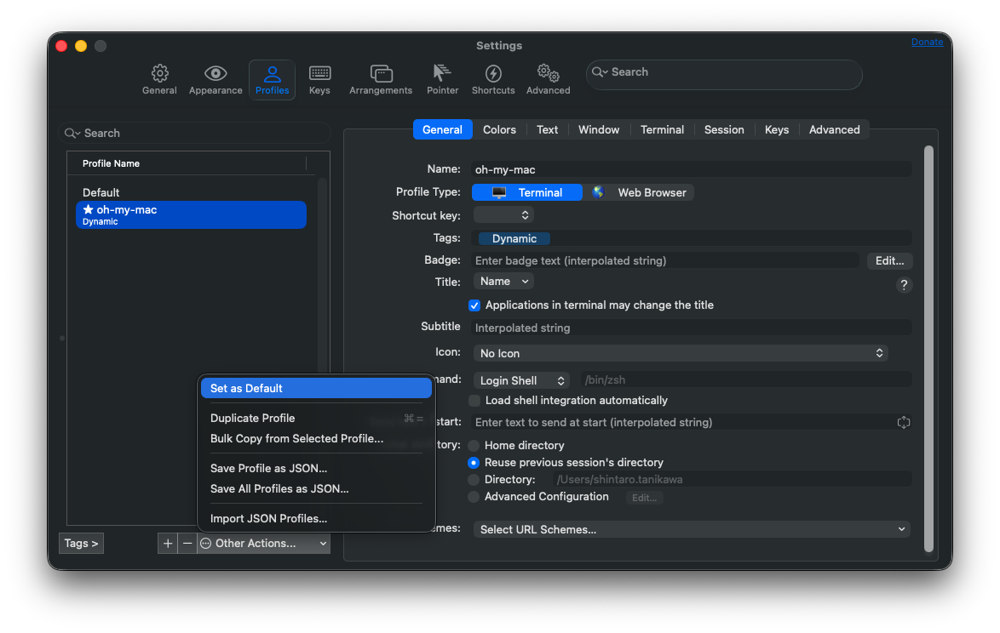

# oh-my-mac

My Mac setup. Apple Silicon only.

## Prerequisites

### Homebrew

```bash
/bin/bash -c "$(curl -fsSL https://raw.githubusercontent.com/Homebrew/install/HEAD/install.sh)"
```

Initialize the current shell:

```bash
eval "$(/opt/homebrew/bin/brew shellenv)"
```

## Quick Start

```bash
mkdir -p ~/dev
git clone https://github.com/tani-shi/oh-my-mac.git ~/dev/oh-my-mac
cd ~/dev/oh-my-mac
make install
```

On an existing Mac, back up `~/.claude/agents/` and `~/.claude/scripts/` first. Install and update delete entries absent from this repository.

Claude Code skills and plugins are managed on the claude.ai account and synced to terminal sessions.

## What's Included

### Homebrew Packages ([Brewfile](Brewfile))

| Category | Packages |
| --- | --- |
| Shell | starship, sheldon, fzf, ripgrep, shellcheck, shfmt |
| Modern CLI replacements | bat, eza, fd, delta, zoxide |
| Terminal | tmux |
| Utilities | jq, sqlite, tree, btop, duti |
| Font | font-jetbrains-mono-nerd-font |
| Development | fnm, direnv, uv, ruff, terraform, awscli, gcloud-cli |
| Git / GitHub | gh, git-lfs |

### GUI Apps ([Brewfile.install-only](config/homebrew/Brewfile.install-only))

Apps in this list use their own updaters. Both `make install` and `make update` use Homebrew only to install missing apps; update installed apps through their own update controls.

### CLI Tools

| Tool | Version |
| --- | --- |
| Claude Code | [config/claude/version](config/claude/version) |
| Node.js (fnm) | [config/fnm/version](config/fnm/version) |
| Notion CLI | [config/ntn/version](config/ntn/version) |
| Codex CLI | Installed if missing |

### Config Files

| Source | Destination |
| --- | --- |
| `config/starship.toml` | `~/.config/starship.toml` |
| `config/sheldon/plugins.toml` | `~/.config/sheldon/plugins.toml` |
| `config/zshrc` | `~/.zshrc` |
| `config/git/ignore` | `~/.config/git/ignore` |
| `config/claude/settings.json` | `~/.claude/settings.json` |
| `config/claude/keybindings.json` | `~/.claude/keybindings.json` |
| `config/codex/config.toml` | `~/.codex/config.toml` |
| `config/vscode/settings.json` | `~/Library/Application Support/Code/User/settings.json` |
| `config/iterm2/profile.json` | `~/Library/Application Support/iTerm2/DynamicProfiles/profile.json` |
| `config/edge/policies.mobileconfig` | Microsoft Edge policies (user configuration profile, approved in System Settings) |

### uv Tools ([config/uv/tools.txt](config/uv/tools.txt))

| Tool | Source |
| --- | --- |
| agent-sentinel | [tani-shi/agent-sentinel](https://github.com/tani-shi/agent-sentinel) |
| claude-sessions | [tani-shi/claude-sessions](https://github.com/tani-shi/claude-sessions) |

### VSCode Extensions ([config/vscode/extensions.txt](config/vscode/extensions.txt))

| Extension | Description |
| --- | --- |
| kaiwood.center-editor-window | Center the active line in the editor |
| ms-dotnettools.csharp | C# language support |
| ms-dotnettools.csdevkit | C# Dev Kit |

## Usage

| Command | Description |
| --- | --- |
| `make install` | Install packages + sync config |
| `make update` | Update Homebrew packages + apply declared tools and config |

For pinned version updates, run `$upgrade` in Codex. Review and merge the PR, pull the changes, then run `make update`.

## Post-install Setup

### SSH key + GitHub auth

```bash
ssh-keygen
gh auth login
# Protocol: SSH / Key: id_ed25519
```

### Notion CLI

```bash
ntn login
```

### Codex CLI

```bash
codex login
```

Trust the installed hooks in **Settings → Hooks** (Codex app) or `/hooks` (CLI).

### Microsoft Edge (Claude in Chrome)

Edge is the dedicated browser for Claude in Chrome, separate from everyday Chrome sessions.

1. `make install` opens the Edge policy profile. Approve it in **System Settings → General → Device Management**. `make sync-config` reopens it whenever the policies change.
2. Install the [Claude extension](https://chromewebstore.google.com/detail/fcoeoabgfenejglbffodgkkbkcdhcgfn) in Edge (allow extensions from other stores) and sign in.
3. Remove the extension from Chrome so Edge is the only connected browser.
4. In Claude Code, run `/chrome` and select **Enabled by default**.

Keep Edge running while using browser tools. Claude Code does not launch it.

### iTerm2

Set **Profiles → oh-my-mac → Other Actions… → Set as Default**.



For SSH with native tabs and splits:

```bash
ssh host -t 'tmux -CC new -A -s main'
```

In **Settings → General → tmux**:

- **Attaching**: Tabs in the attaching window
- **Automatically bury the tmux client session after connecting**: ON

Allow notifications for iTerm2 in **System Settings → Notifications** so Claude Code notifications appear.

### macOS

In **System Settings → Accessibility → Display**:

- **Reduce Motion**: ON
- **Reduce Transparency**: ON
